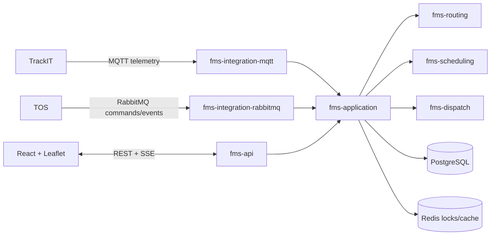

# DPW FMS

DPW FMS is an original fleet orchestration platform for terminal vehicles, trucks, trailers and service resources. This repository delivers a runnable vertical slice: immutable job lifecycle, A\* directed-graph routing, candidate scoring and atomic reservation, idempotent telemetry processing, reliable dispatch commands, PostgreSQL/Flyway persistence, secured APIs, SSE updates, a simulator, and a clustered Leaflet dashboard.

Automatic parking and fueling now use a versioned deterministic rule engine with scope precedence, fuel hysteresis, candidate scoring, atomic reservations, idempotency keys, decision/audit history, REST administration, scheduled reconciliation, simulator scenarios, and an Automation dashboard. See [automatic parking and fueling](docs/automation.md).

The administration workspace supports database-backed user creation with BCrypt credentials, role and plant assignments, protected Super Admin safeguards, and frontend map-provider configuration. The overview reports total fleet, fleet in operation, fueling stations, charging stations, orders, and alerts directly from PostgreSQL.

The visible application navigation is intentionally limited to implemented workspaces. Vehicle markers come from accepted, deduplicated PostgreSQL telemetry rather than browser simulation; submit normalized positions through the authorized telemetry API described in `docs/integrations.md`.

## Repository assessment and architecture

The repository was initially empty apart from Git metadata. It is now a Java 21 Maven reactor whose domain and engines have no dependency on Spring or transport protocols. Adapters point inward through application contracts; `fms-api` is the composition root. See [architecture and phased gaps](docs/architecture.md).



## Quick start

Requirements: JDK 21, Maven 3.9+, Node 22+, or Docker Compose.

```bash
mvn clean verify
cd fms-web && npm ci && npm run build
docker compose up --build
```

Open dashboard at <http://localhost:3000>, Swagger at <http://localhost:8080/swagger-ui.html>, health at <http://localhost:8080/actuator/health>, RabbitMQ management at <http://localhost:15672>. Local development credentials are supplied through `DPWFMS_LOCAL_USERNAME` and `DPWFMS_LOCAL_PASSWORD`; no credential is committed.

To create the development users `dispatcher.demo`, `operator.demo`, and `viewer.demo`, set `DPWFMS_SAMPLE_USER_PASSWORD` to a password of at least 12 characters after starting the API, then run `./scripts/add-sample-users.sh`. On Windows use `.\scripts\add-sample-users.ps1`. Both scripts use the audited user API and leave existing usernames unchanged.

```bash
curl -u "$DPWFMS_LOCAL_USERNAME:$DPWFMS_LOCAL_PASSWORD" http://localhost:8080/api/assets
curl -u "$DPWFMS_LOCAL_USERNAME:$DPWFMS_LOCAL_PASSWORD" -H 'Content-Type: application/json' -d '{"type":"CONTAINER_TRANSPORT","priority":80,"source":"QUAY-01","destination":"YARD-03","requiredCapabilities":["TWISTLOCK"]}' http://localhost:8080/api/jobs
```

## Operational status

This is a tested foundation and working vertical slice, **not a claim of complete production readiness**. Remaining phases include durable repository implementations for every aggregate, DPWUM deployment integration, Redis-backed locks, complete map administration, real TrackIT certification, telemetry partition maintenance, broad Testcontainers coverage, and a production load/security/HA exercise. See the checklists and exact protocols in `docs/`.
