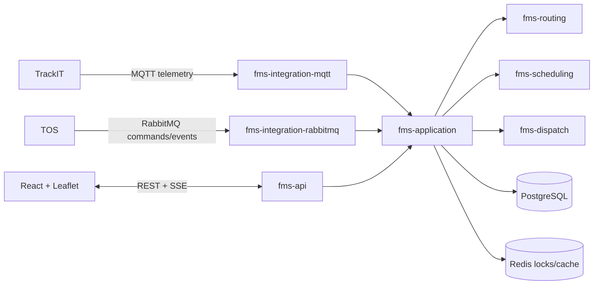

# DPW FMS

DPW FMS is an original fleet orchestration platform for terminal vehicles, trucks, trailers and service resources. This repository delivers a runnable vertical slice: immutable job lifecycle, A\* directed-graph routing, candidate scoring and atomic reservation, idempotent telemetry processing, reliable dispatch commands, PostgreSQL/Flyway persistence, secured APIs, SSE updates, a simulator, and a clustered Leaflet dashboard.

Automatic parking and fueling now use a versioned deterministic rule engine with scope precedence, fuel hysteresis, candidate scoring, atomic reservations, idempotency keys, decision/audit history, REST administration, scheduled reconciliation, simulator scenarios, and an Automation dashboard. See [automatic parking and fueling](docs/automation.md).

The administration workspace supports database-backed user creation with BCrypt credentials, role and plant assignments, protected Super Admin safeguards, and frontend map-provider configuration. The overview reports total fleet, fleet in operation, fueling stations, charging stations, orders, and alerts directly from PostgreSQL.

The visible application navigation is intentionally limited to implemented workspaces. Vehicle markers come from accepted, deduplicated PostgreSQL telemetry rather than browser simulation; submit normalized positions through the authorized telemetry API described in `docs/integrations.md`.

## Repository assessment and architecture

The repository was initially empty apart from Git metadata. It is now a Java 21 Maven reactor whose domain and engines have no dependency on Spring or transport protocols. Adapters point inward through application contracts; `fms-api` is the composition root. See [architecture and phased gaps](docs/architecture.md).



## Quick start

Requirements: JDK 21, Maven 3.9+, Node 22+, or Docker Compose.

```bash
mvn clean verify
cd fms-web && npm ci && npm run build
docker compose up --build
```

Open dashboard at <http://localhost:3000>, Swagger at <http://localhost:8080/swagger-ui.html>, health at <http://localhost:8080/actuator/health>, RabbitMQ management at <http://localhost:15672>. Local development credentials are supplied through `DPWFMS_LOCAL_USERNAME` and `DPWFMS_LOCAL_PASSWORD`; no credential is committed.

To create the development users `dispatcher.demo`, `operator.demo`, and `viewer.demo`, set `DPWFMS_SAMPLE_USER_PASSWORD` to a password of at least 12 characters after starting the API, then run `./scripts/add-sample-users.sh`. On Windows use `.\scripts\add-sample-users.ps1`. Both scripts use the audited user API and leave existing usernames unchanged.

Alternatively, Flyway V7 creates four fixed but disabled/passwordless database records. When running with the Spring `dev` profile, set `DPWFMS_SAMPLE_USERS_ENABLED=true` and `DPWFMS_SAMPLE_USER_PASSWORD`; the application securely activates those migration-managed users with all permissions without overwriting user-created accounts. Map viewing requires `map.read`, `vehicle.read`, and a plant assignment; see `ROLE_PERMISSION_MATRIX.md` for the exact grants and SQL.

For an end-to-end walkthrough using deterministic vehicle telemetry, see [`MOCK_DATA_TESTING.md`](MOCK_DATA_TESTING.md). Detailed OpenStreetMap and Google Maps integration steps are in [`MAP_CONFIGURATION.md`](MAP_CONFIGURATION.md) and [`GOOGLE_MAPS_SETUP.md`](GOOGLE_MAPS_SETUP.md).

To run the API under the Eclipse debugger with local broker/database infrastructure and a local-only all-permissions demo login, follow [`ECLIPSE_SETUP.md`](ECLIPSE_SETUP.md).

```bash
curl -u "$DPWFMS_LOCAL_USERNAME:$DPWFMS_LOCAL_PASSWORD" http://localhost:8080/api/assets
curl -u "$DPWFMS_LOCAL_USERNAME:$DPWFMS_LOCAL_PASSWORD" -H 'Content-Type: application/json' -d '{"type":"CONTAINER_TRANSPORT","priority":80,"source":"QUAY-01","destination":"YARD-03","requiredCapabilities":["TWISTLOCK"]}' http://localhost:8080/api/jobs
```

## Operational status

This is a tested foundation and working vertical slice, **not a claim of complete production readiness**. Remaining phases include durable repository implementations for every aggregate, DPWUM deployment integration, Redis-backed locks, complete map administration, real TrackIT certification, telemetry partition maintenance, broad Testcontainers coverage, and a production load/security/HA exercise. See the checklists and exact protocols in `docs/`.

## Operational automation workspaces

The React application extends the existing control-room shell with Operations
Dashboard, Live Fleet Map, Jobs & Dispatch, Automatic Parking, Automatic
Charging, Alerts, Reports and Operational Parameters workspaces. OpenStreetMap
is the default free online provider; offline Jebel Ali XYZ tiles and optional
Google/Mapbox providers remain environment-configured. No frontend bundle
contains a map key.

Flyway V10 adapts the existing parking zones/spaces and service stations/bays,
then adds assignment history, charging queue/capacity state, operational
parameter versions, exceptions, constraints, permissions and safe JEA sample
inventory. Apply it by starting the API normally; never edit or manually rerun
an already-applied migration.

Automatic parking defaults to `SUGGEST_ONLY`. An operator can preview candidates
and their rejection reasons before approval. Switching to `AUTOMATIC` requires
the persisted operational parameters and eligible fresh telemetry. Bay
reservation is serialized and protected by partial unique indexes.

Automatic charging uses station capacity plus individual slots. The backend
locks a station and slot transactionally, queues only within the configured
maximum, creates an existing DPWFMS job for immediate assignments and promotes
the next queued asset when a slot is released. Capacity cannot be reduced below
active assignments or above active slot inventory.

Operational parameters are stored as immutable database versions. Updates and
rollbacks require dedicated permissions and a change reason; optimistic version
checks reject stale browser forms. Secrets, connection strings and map keys are
not operational parameters.

Relevant permissions include `parking.assign`, `parking.override`,
`parking.bay.manage`, `parking.automation.run`, `charging.assign`,
`charging.override`, `charging.station.manage`, `charging.automation.run`,
`parameters.read`, `parameters.edit`, `parameters.rollback` and the existing
`audit.read`. Java method security is authoritative; frontend visibility is not
a security boundary.

Validation commands:

```bash
mvn clean test
mvn clean package -DskipTests
cd fms-web && npm run build
```

Migration/concurrency integration tests require a Docker-accessible PostgreSQL
instance through Testcontainers. RabbitMQ telemetry simulation is documented in
[RABBITMQ_TELEMETRY.md](RABBITMQ_TELEMETRY.md).

## Production geographic routing

Operational routing is owned by `ProductionRoutingService`: it loads only an explicitly activated,
approved PostgreSQL graph, runs the existing A*/Dijkstra engine, and persists every successful or
failed route request. JavaScript only renders the returned WGS84 GeoJSON. No production graph or
terminal coordinates are committed to this repository.

1. Mount the terminal `.osm.pbf` and reviewed override YAML outside the application image.
2. Set `ROUTING_GRAPH_FILE` and `ROUTING_OVERRIDE_FILE` (see `.env.example`).
3. Validate and import through `/api/routing/graphs/validate` and `/api/routing/graphs/import`.
4. Review, approve, then activate the DRAFT with the separately permissioned endpoints.

Activation never happens during import. The previously active graph remains usable until activation,
and rollback is performed by reviewing/approving (when necessary) and activating the desired retained
version. See [Geographic routing operations](docs/geographic-routing.md) for configuration, permission,
validation, map-matching, deployment and rollback details.

Routing checks are included in the normal reactor and web commands:

```bash
./mvnw -B clean test
./mvnw -B -DskipTests package
cd fms-web && npm ci && npm run build
```
