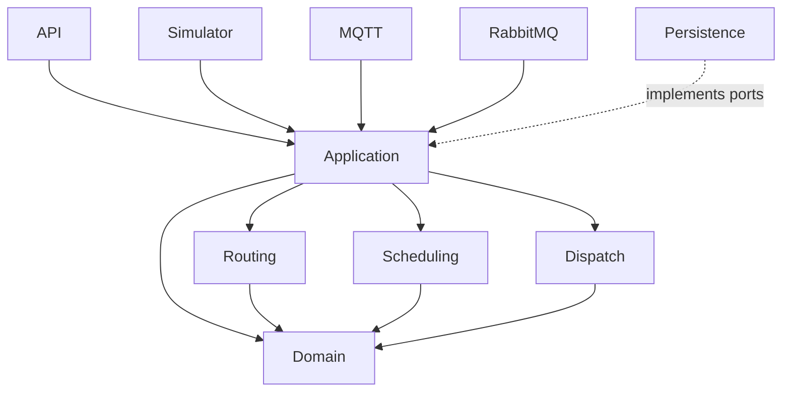
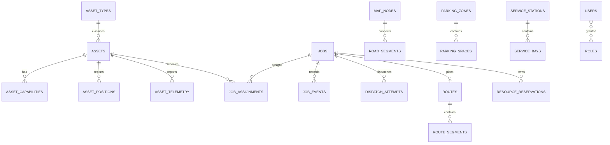

# Solution architecture and delivery phases

## Boundaries

| Module | Responsibility |
|---|---|
| `fms-domain` | Assets, job aggregate, immutable event history and invariants |
| `fms-routing` | Transport-neutral directed graph and A\* implementation |
| `fms-scheduling` | Eligibility, configurable scoring and atomic resource reservation |
| `fms-dispatch` | Idempotent command attempts and acknowledgement state |
| `fms-application` | Use-case coordination and telemetry ordering/deduplication |
| `fms-persistence` | Normalized PostgreSQL schema and Flyway migrations |
| integration modules | MQTT topic policy and RabbitMQ durable topology |
| `fms-api` | Secured REST/SSE composition root, OpenAPI and metrics |
| `fms-simulator` | Deterministic sample fleet, configurable from 1 to 1,500 assets |
| `fms-web` | Responsive, viewport-ready clustered Leaflet dashboard |

## Data model

## Delivery status and phases

1. **Implemented foundation:** model, lifecycle, graph routing, scoring, concurrency-safe in-process reservations, dedupe/order protection, dispatch attempt identity, schema, API, security baseline, simulation fleet and dashboard.
2. **Persistence completion:** JPA adapters, transactional outbox/inbox, Redis Redlock/DB advisory locking, partition rotation and reconciliation runners.
3. **Operational workflows:** durable auto-parking/fuel/charge policies, station queues, retries, escalation and recovery across restarts.
4. **Integrations:** TrackIT/DPWUM certification, MQTT persistent session adapter, all Rabbit consumers, schema registry/contract testing.
5. **Administration and assurance:** full visual graph editor, role screens, offline tile packaging, 1,500-asset load test, penetration/failover/restore exercises.

The application is structured for these increments without circular dependencies; limitations are explicit rather than represented as placeholder code.
